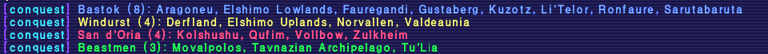

# conquest

## Overview

Displays which nations (San d'Oria, Bastok, Windurst) and Beastmen currently control each region for conquest.

## Features

- **Simple command**: Type `/conquest` or `/regions` to see who owns which region
- **Color-coded output**: San d'Oria (red), Bastok (yellow), Windurst (blue), Beastmen (green)

## Installation

1. Place the `conquest` folder in your `Game/addons/` directory
2. Use `/addon load conquest` or add the addon to your default script to load every game launch

## Usage

- `/conquest` - Shows conquest region ownership
- `/regions` - Same as above

More addons @ https://github.com/AddonsXI